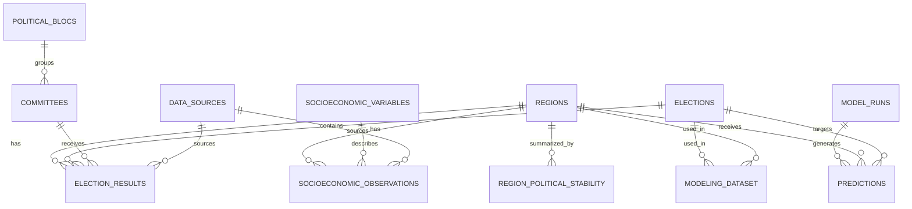

# Database Schema

## Scope

This document is the authoritative contract for the PostgreSQL schemas, tables, relationships,
constraints, indexes, and derived database objects used by `electoral-drift`. Use `CONTEXT.md` for
domain language and `docs/adr/` for the reasons behind consequential architectural decisions.

## Core design principles

Follow these principles when creating or modifying the database layer:

1. **One table, one responsibility.** Each table should represent one entity or fact type.
2. **Facts and interpretations must be separated.** Election results and socioeconomic observations are facts; bloc mappings, stability labels, and ML features are interpretations or derived data.
3. **Annual structural data and election events must be stored separately.** Do not force GUS/BDL yearly data into election-result tables.
4. **Use stable identifiers.** Store TERC identifiers in `teryt_code` as text, never as integers.
5. **Use explicit foreign keys.** Relationships between tables must be enforced by the database.
6. **Avoid data leakage.** For an election in year `Y`, ML features may use only data known no later than `Y - 1`.
7. **Raw data should be reproducible and preferably immutable.** Derived tables should be rebuildable from scripts or migrations.
8. **Keep the ML dataset as a derived layer.** Do not manually edit `ml.modeling_dataset`.

## Required database schemas

Create these PostgreSQL schemas unless the repository already has a different convention:

```sql
CREATE SCHEMA IF NOT EXISTS raw;
CREATE SCHEMA IF NOT EXISTS core;
CREATE SCHEMA IF NOT EXISTS analytics;
CREATE SCHEMA IF NOT EXISTS ml;
```

Use `core` for normalized source-of-truth tables, `analytics` for derived analytical summaries, and `ml` for model datasets, model runs, and predictions.

## Required core tables

Implement the following normalized tables in the `core` schema.

### `core.canonical_regions`

Stores the stable analytical identity shared by historical TERC versions of one municipality.

Required columns:

- `id BIGINT GENERATED ALWAYS AS IDENTITY PRIMARY KEY`
- `base_teryt_code VARCHAR(6) UNIQUE NOT NULL`
- `name TEXT NOT NULL`

The initial mapping groups seven-digit TERC identifiers by their first six digits. It supports
changes of municipality type, such as `0603112` to `0603113`, without overwriting source facts.
Merges, splits, and changes to the first six digits require a separately verified crosswalk.

### `core.regions`

Stores territorial units, initially municipalities (`gminy`). A county may be introduced later
as a separate region type or used as a derived aggregation, but it is not the MVP observation
unit.

Required columns:

- `id BIGINT GENERATED ALWAYS AS IDENTITY PRIMARY KEY`
- `canonical_region_id BIGINT REFERENCES core.canonical_regions(id)`
- `teryt_code VARCHAR(20) UNIQUE NOT NULL`
- `name TEXT NOT NULL`
- `region_type TEXT NOT NULL`
- `voivodeship TEXT`
- `valid_from DATE`
- `valid_to DATE`

Notes:

- `teryt_code` must be text.
- Do not join regions by name.
- `valid_from` and `valid_to` are used for future support of administrative boundary changes.

### `core.elections`

Stores election events.

Required columns:

- `id BIGINT GENERATED ALWAYS AS IDENTITY PRIMARY KEY`
- `election_date DATE NOT NULL`
- `election_year INT NOT NULL`
- `election_type TEXT NOT NULL`
- `round INT DEFAULT 1`
- `description TEXT`

Accepted initial `election_type` values:

- `parliamentary`
- `presidential`
- `european`
- `local`

A second round of presidential elections should be represented as a separate row with `round = 2`.

### `core.political_blocs`

Stores analytical political blocs.

Required columns:

- `id BIGINT GENERATED ALWAYS AS IDENTITY PRIMARY KEY`
- `name TEXT UNIQUE NOT NULL`
- `description TEXT`

Seed or support these initial bloc names:

- `pis_bloc`
- `ko_bloc`
- `left_bloc`
- `psl_td_bloc`
- `confederation_bloc`
- `other`

### `core.committees`

Stores committees, parties, lists, or presidential candidates within a specific election.

Required columns:

- `id BIGINT GENERATED ALWAYS AS IDENTITY PRIMARY KEY`
- `name TEXT NOT NULL`
- `election_id BIGINT NOT NULL REFERENCES core.elections(id)`
- `bloc_id BIGINT REFERENCES core.political_blocs(id)`
- `UNIQUE(name, election_id)`

Examples of intended mapping:

- `Prawo i Sprawiedliwość` -> `pis_bloc`
- `Zjednoczona Prawica` -> `pis_bloc`
- `Andrzej Duda` -> `pis_bloc`
- `Koalicja Obywatelska` -> `ko_bloc`
- `Rafał Trzaskowski` -> `ko_bloc`
- `Lewica` -> `left_bloc`

### `core.data_sources`

Stores source metadata for imports.

Required columns:

- `id BIGINT GENERATED ALWAYS AS IDENTITY PRIMARY KEY`
- `source_name TEXT NOT NULL`
- `source_url TEXT`
- `downloaded_at TIMESTAMP`
- `description TEXT`

### `core.election_results`

Stores election results by region, election, and committee.

Required columns:

- `id BIGINT GENERATED ALWAYS AS IDENTITY PRIMARY KEY`
- `region_id BIGINT NOT NULL REFERENCES core.regions(id)`
- `election_id BIGINT NOT NULL REFERENCES core.elections(id)`
- `committee_id BIGINT NOT NULL REFERENCES core.committees(id)`
- `bloc_id BIGINT REFERENCES core.political_blocs(id)`
- `votes INT`
- `vote_share NUMERIC(8, 4)`
- `turnout NUMERIC(8, 4)`
- `eligible_voters INT`
- `valid_votes INT`
- `source_id BIGINT REFERENCES core.data_sources(id)`
- `UNIQUE(region_id, election_id, committee_id)`

Convention:

- Store `vote_share` and `turnout` as percentages, e.g. `42.3000` for 42.3%, not as fractions.
- Keep this convention consistent in API responses, analytics, and ML features.

### `core.socioeconomic_variables`

Stores variable definitions for GUS/BDL, ISKK, TERYT-derived data, or other sources.

Required columns:

- `id BIGINT GENERATED ALWAYS AS IDENTITY PRIMARY KEY`
- `code TEXT UNIQUE NOT NULL`
- `name TEXT NOT NULL`
- `source TEXT NOT NULL`
- `unit TEXT`
- `description TEXT`

Expected initial variable codes may include:

- `registered_unemployed_working_age_share`
- `income_per_capita`
- `dominicantes`
- `communicantes`
- `age_65_plus_share`
- `migration_balance`
- `urbanization_rate`
- `population_density`
- `higher_education_share`

### `core.socioeconomic_observations`

Stores values of structural variables in long format.

Required columns:

- `id BIGINT GENERATED ALWAYS AS IDENTITY PRIMARY KEY`
- `region_id BIGINT NOT NULL REFERENCES core.regions(id)`
- `variable_id BIGINT NOT NULL REFERENCES core.socioeconomic_variables(id)`
- `year INT NOT NULL`
- `value NUMERIC`
- `source_id BIGINT REFERENCES core.data_sources(id)`
- `source_note TEXT`
- `UNIQUE(region_id, variable_id, year)`

Do not create one wide table with a column per GUS variable as the source-of-truth storage. Wide tables may be generated later as derived ML datasets.

## Required analytics objects

Implement derived analytics in the `analytics` schema.

### `analytics.region_election_summary`

Create as a view or materialized view. It should aggregate committee-level results to political blocs.

Required output columns:

- `region_id`
- `election_id`
- `election_year`
- `election_type`
- `bloc_name`
- `votes`
- `vote_share`

Use `NULLIF(..., 0)` when dividing by valid votes.

### `analytics.region_political_stability`

Create as a table, view, or materialized view depending on implementation needs.

Required columns:

- `region_id BIGINT PRIMARY KEY REFERENCES core.regions(id)`
- `pis_wins INT`
- `ko_wins INT`
- `other_wins INT`
- `switch_count INT`
- `avg_winner_margin NUMERIC(8, 4)`
- `avg_abs_pis_ko_margin NUMERIC(8, 4)`
- `pis_ko_margin_trend NUMERIC(8, 4)`
- `volatility_score NUMERIC(8, 4)`
- `stability_label TEXT`

Accepted initial `stability_label` values:

- `safe_pis`
- `safe_ko`
- `swing`
- `emerging_shift`
- `fragmented_or_local`

Initial calculation rules:

- Determine winners from bloc-level `vote_share`, ordered by `election_date`, `round`, and
  `election_id`.
- A tie for the highest vote share has no winner and does not increment any win counter.
- `switch_count` compares consecutive elections with a unique winner.
- One winner change is `emerging_shift`; two or more changes are `swing`.
- At least two uniquely decided elections with no change are `safe_pis` or `safe_ko` when that
  bloc won throughout; other or insufficient histories are `fragmented_or_local`.
- `volatility_score` is the mean absolute change in the PiS–KO margin between consecutive
  elections where both blocs are present.
- Rebuild this table as a batch snapshot. HTTP requests must only read the stored metrics.

## Required ML objects

Implement these objects in the `ml` schema.

### `ml.modeling_dataset`

Stores the final ML training rows. This table is derived and should be rebuildable.

Required columns:

- `id BIGINT GENERATED ALWAYS AS IDENTITY PRIMARY KEY`
- `region_id BIGINT NOT NULL REFERENCES core.regions(id)`
- `election_id BIGINT NOT NULL REFERENCES core.elections(id)`
- `previous_pis_vote_share NUMERIC(8, 4)`
- `previous_ko_vote_share NUMERIC(8, 4)`
- `previous_pis_ko_margin NUMERIC(8, 4)`
- `unemployment_level NUMERIC(12, 4)`
- `unemployment_delta_4y NUMERIC(12, 4)`
- `income_level NUMERIC(12, 4)`
- `income_delta_4y NUMERIC(12, 4)`
- `dominicantes_level NUMERIC(12, 4)`
- `dominicantes_delta_4y NUMERIC(12, 4)`
- `age_65_plus_level NUMERIC(12, 4)`
- `age_65_plus_delta_4y NUMERIC(12, 4)`
- `migration_balance_level NUMERIC(12, 4)`
- `migration_balance_delta_4y NUMERIC(12, 4)`
- `target_pis_vote_share NUMERIC(8, 4)`
- `target_ko_vote_share NUMERIC(8, 4)`
- `target_pis_ko_margin NUMERIC(8, 4)`
- `target_margin_delta NUMERIC(8, 4)`
- `target_winner_changed BOOLEAN`
- `UNIQUE(region_id, election_id)`

Leakage rule:

- For election year `Y`, all structural feature columns must be computed from observations with `year <= Y - 1`.

### `ml.model_runs`

Tracks ML experiments.

Required columns:

- `id BIGINT GENERATED ALWAYS AS IDENTITY PRIMARY KEY`
- `model_name TEXT NOT NULL`
- `target TEXT NOT NULL`
- `trained_at TIMESTAMP NOT NULL DEFAULT now()`
- `train_period TEXT`
- `test_period TEXT`
- `params JSONB`
- `metrics JSONB`

### `ml.predictions`

Stores predictions and residuals.

Required columns:

- `id BIGINT GENERATED ALWAYS AS IDENTITY PRIMARY KEY`
- `model_run_id BIGINT NOT NULL REFERENCES ml.model_runs(id)`
- `region_id BIGINT NOT NULL REFERENCES core.regions(id)`
- `election_id BIGINT NOT NULL REFERENCES core.elections(id)`
- `predicted_value NUMERIC(12, 4)`
- `actual_value NUMERIC(12, 4)`
- `residual NUMERIC(12, 4)`
- `UNIQUE(model_run_id, region_id, election_id)`

## Entity relationship diagram

Keep this diagram updated when schema changes are made.



## Required indexes

Create indexes for common joins and filters:

```sql
CREATE INDEX IF NOT EXISTS idx_election_results_region_election
ON core.election_results(region_id, election_id);

CREATE INDEX IF NOT EXISTS idx_election_results_committee
ON core.election_results(committee_id);

CREATE INDEX IF NOT EXISTS idx_election_results_bloc
ON core.election_results(bloc_id);

CREATE INDEX IF NOT EXISTS idx_socio_region_year
ON core.socioeconomic_observations(region_id, year);

CREATE INDEX IF NOT EXISTS idx_socio_variable_year
ON core.socioeconomic_observations(variable_id, year);

CREATE INDEX IF NOT EXISTS idx_elections_year_type
ON core.elections(election_year, election_type);
```

## Testing requirements

When implementing schema or import logic, add tests that verify:

1. Required schemas exist: `raw`, `core`, `analytics`, `ml`.
2. Required tables exist.
3. Foreign keys reject invalid references.
4. Unique constraints prevent duplicate election results and duplicate socioeconomic observations.
5. TERC identifiers preserve leading zeros.
6. `vote_share` convention is consistent.
7. ML feature-building logic does not use observations from `year >= election_year`.

Prefer integration tests against a disposable PostgreSQL database when possible.

## SQL style

- Use lowercase snake_case for table, column, index, and constraint names.
- Prefer explicit schema-qualified names in migrations, e.g. `core.regions`.
- Use `BIGINT GENERATED ALWAYS AS IDENTITY` for surrogate primary keys.
- Use foreign keys for all entity relationships.
- Use `NUMERIC` for percentages and values where reproducibility matters.
- Add `UNIQUE` constraints for natural uniqueness rules.
- Use `NULLIF` for divisions where denominator can be zero.

## Do not do

- Do not store TERC identifiers as integers.
- Do not join regions by names.
- Do not put all GUS/BDL variables into one source-of-truth wide table.
- Do not mix raw election facts with political interpretations.
- Do not manually edit derived ML tables.
- Do not compute ML features from data after the election year.
- Do not silently change the percentage convention from percentage points to fractions.
- Do not remove stable municipalities from source data; they are needed as a contrast class for
  modeling.
