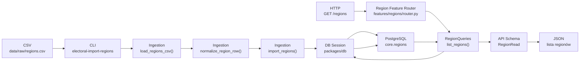
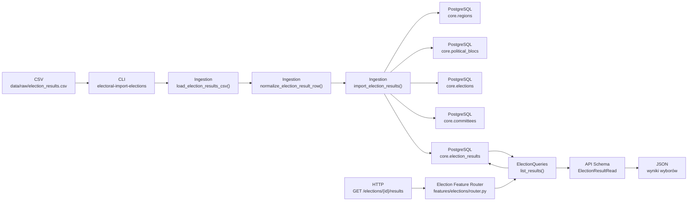
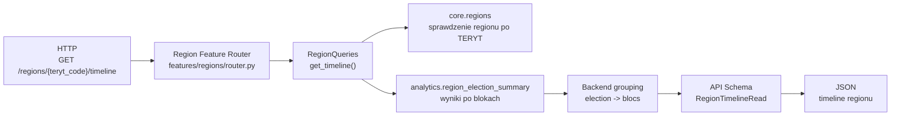
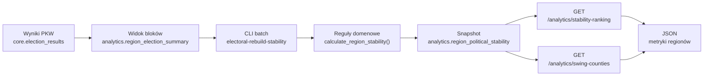
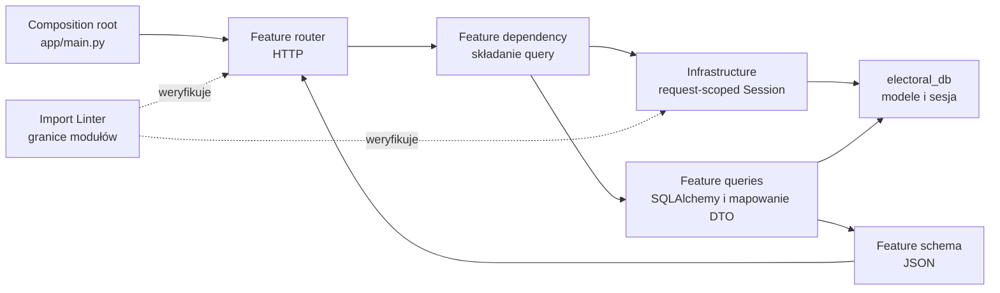
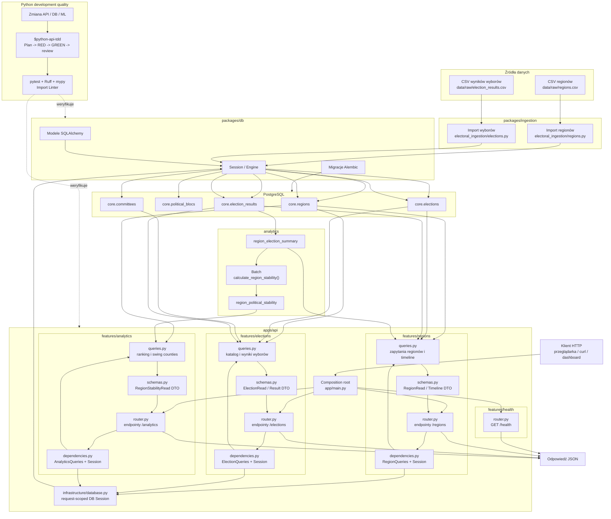

# Dokumentacja Flow Aplikacji

## Instrukcja Dla Codexa

Cel tego dokumentu: utrzymywać czytelną, chronologiczną dokumentację przepływu danych i
odpowiedzialności w aplikacji `electoral-drift`.

Przy każdym nowym feature aktualizuj ten plik według zasad:

- Dodaj nowy wpis w sekcji `Logi Flow`.
- Każdy wpis powinien zawierać:
  - krótki opis funkcjonalności,
  - diagram Mermaid pokazujący flow tylko dla tej funkcjonalności,
  - krótki opis diagramu w punktach.
- Dokument pisz po polsku.
- Diagramy Mermaid trzymaj możliwie proste i opisowe.
- Po każdym feature zaktualizuj sekcję `Aktualny Flow Całej Aplikacji` na dole pliku.
- Nie usuwaj starszych logów, chyba że użytkownik wyraźnie o to poprosi.
- Używaj nazw katalogów i funkcji zgodnych z aktualnym kodem.

## Logi Flow

### 2026-07-16 - Regiony: Import CSV I Odczyt Przez API

Dodano pierwszy pełny przepływ dla danych regionów. Regiony można zaimportować z pliku CSV do
tabeli `core.regions`, a następnie pobrać przez endpointy FastAPI.

Opis diagramu:

- Plik CSV jest wejściem dla procesu ingestion.
- Komenda `electoral-import-regions` uruchamia import regionów.
- `load_regions_csv()` czyta plik CSV.
- `normalize_region_row()` waliduje pojedynczy wiersz i pilnuje, aby `teryt_code` został tekstem.
- `import_regions()` zapisuje nowe regiony albo aktualizuje istniejące po `teryt_code`.
- API nie importuje CSV podczas requestu.
- Endpoint `GET /regions` czyta dane już zapisane w `core.regions`.
- `RegionRead` określa publiczny kształt odpowiedzi JSON.

### 2026-07-16 - Wybory: Import Wyników I Odczyt Przez API

Dodano przepływ dla podstawowych danych wyborczych. Jeden plik CSV może utworzyć wybory,
komitety oraz wyniki komitetów w regionach.

Opis diagramu:

- Plik CSV jest wejściem dla importu wyników wyborczych.
- Importer wymaga, aby regiony i bloki polityczne istniały wcześniej w bazie.
- `import_election_results()` tworzy brakujące wybory i komitety.
- Wyniki są zapisywane do `core.election_results`.
- Import jest idempotentny: istniejący wynik jest aktualizowany albo oznaczany jako bez zmian.
- API czyta wyniki z bazy przez `GET /elections/{election_id}/results`.
- `ElectionResultRead` określa publiczny kształt odpowiedzi JSON.

### 2026-07-17 - Timeline Regionu: Gotowy Widok Pod Frontend

Dodano endpoint `GET /regions/{teryt_code}/timeline`. Backend czyta zagregowane dane z
widoku `analytics.region_election_summary` i układa je w małą strukturę gotową pod wykres
historii politycznej jednego regionu.

Opis diagramu:

- Frontend pyta o historię jednego regionu, a nie o całą bazę wyników.
- Service najpierw sprawdza, czy `teryt_code` istnieje w `core.regions`.
- Dane liczbowe są czytane z `analytics.region_election_summary`, czyli z widoku po blokach.
- Backend układa płaskie rekordy w strukturę `election -> blocs`.
- Odpowiedź jest gotowa do wyświetlenia na wykresie lub w tabeli.
- API zwraca `404`, jeśli region o podanym `teryt_code` nie istnieje.

### 2026-07-25 - Python: TDD I Bramka Jakości Architektury

Dodano repozytoryjny skill `$python-api-tdd` dla API, warstwy DB i przyszłego pakietu ML.
Skill wymaga zaakceptowanego planu, potwierdzonego testu RED, minimalnej implementacji GREEN,
refaktoryzacji, przeglądu REP/CCP/CRP oraz kompletnej bramki jakości.

```mermaid
flowchart LR
    task["Zmiana Python<br/>API / DB / ML"]
    plan["Plan<br/>zależności i testy"]
    approval["Akceptacja<br/>użytkownika"]
    red["RED<br/>oczekiwany błąd testu"]
    green["GREEN<br/>minimalna implementacja"]
    review["Refactor i self-review<br/>REP / CCP / CRP / komentarze"]
    tests["pytest"]
    ruff["Ruff<br/>lint i format-check"]
    types["mypy"]
    imports["Import Linter"]
    done["Gotowa zmiana<br/>raport wyników"]

    task --> plan
    plan --> approval
    approval --> red
    red --> green
    green --> review
    review --> tests
    tests --> ruff
    ruff --> types
    types --> imports
    imports --> done
```

Opis diagramu:

- Implementacja nie rozpoczyna się przed jawną akceptacją planu.
- RED musi potwierdzić brak oczekiwanego zachowania, a nie błąd konfiguracji testu.
- GREEN zawiera najmniejszą poprawną implementację, po której następuje refaktoryzacja.
- Self-review sprawdza prostotę, komentarze oraz semantyczną zgodność z REP, CCP i CRP.
- `pytest`, Ruff, mypy i Import Linter są obowiązkowymi bramkami końcowymi.
- Import Linter pilnuje kierunku zależności między API i DB; REP, CCP i CRP wymagają także
  przeglądu semantycznego.
- Po wdrożeniu skilla 19 testów przeszło, 1 test integracyjny został pominięty, a linting,
  formatowanie, typowanie i oba kontrakty importów zakończyły się sukcesem.
- Kontrola negatywna potwierdziła, że Import Linter wykrywa zabronioną zależność.

### 2026-07-25 - Stabilność Polityczna Regionów

Dodano powtarzalny proces batch, który przelicza zwycięstwa znormalizowanych bloków
politycznych na podstawie danych PKW. API odczytuje gotowy snapshot stabilności i nie wykonuje
obliczeń analitycznych podczas requestu.

Opis diagramu:

- Wyniki komitetów są najpierw agregowane do stabilnych bloków politycznych.
- Komenda batch porządkuje wybory chronologicznie i rozstrzyga zwycięzcę w każdym regionie.
- Remis nie jest liczony jako zwycięstwo żadnego bloku.
- Snapshot zawiera liczby zwycięstw, zmiany zwycięzcy, marginesy, trend, zmienność i etykietę.
- Jedna zmiana zwycięzcy oznacza `emerging_shift`, a co najmniej dwie oznaczają `swing`.
- Endpoint swing counties zwraca regiony oznaczone jako `swing` lub `emerging_shift`.

### 2026-07-27 - API: Lekkie Moduły Feature’owe

API przeorganizowano z przekrojowych katalogów technicznych na niezależne moduły `health`,
`regions`, `elections` i `analytics`. Każdy feature posiada własny router, kontrakty odpowiedzi,
zapytania oraz składanie zależności.

Opis diagramu:

- `main.py` rejestruje routery, ale nie zawiera logiki feature’ów ani zapytań.
- Router zna lokalny query service i schematy, lecz nie importuje SQLAlchemy ani `electoral_db`.
- `queries.py` jest granicą persystencji: wykonuje zapytania i zwraca feature’owe DTO.
- `dependencies.py` łączy query service z sesją tworzoną w `infrastructure/database.py`.
- Feature’y nie importują się wzajemnie; regionowe wybory są projekcją należącą do `regions`.
- Testy endpointów podmieniają query service zamiast imitować wewnętrzne API SQLAlchemy.
- Import Linter pilnuje niezależności feature’ów i kierunku zależności infrastruktury.

## Aktualny Flow Całej Aplikacji

Ten diagram pokazuje aktualny przepływ całej aplikacji na wysokim poziomie. Powinien być
aktualizowany po każdym dodanym feature.

Najważniejsze zasady aktualnego flow:

- Ingestion zapisuje dane do bazy.
- API czyta dane z bazy i zwraca JSON.
- API jest podzielone na niezależne feature’y, które posiadają własne routery, schematy i zapytania.
- Diagram pokazuje osobno przepływ `health`, `regions`, `elections` i `analytics`; tylko trzy ostatnie
  korzystają z sesji bazodanowej.
- Modele SQLAlchemy nie opuszczają `queries.py`, a routery nie zależą od implementacji persystencji.
- `packages/db` jest wspólną warstwą dla ingestion i API.
- Migracje Alembic definiują strukturę PostgreSQL.
- Wyniki wyborów zależą od wcześniej zaimportowanych regionów i seedowanych bloków politycznych.
- Endpoint timeline czyta zagregowane wyniki po blokach, zamiast wysyłać cały zbiór danych.
- Komenda `electoral-rebuild-stability` atomowo zastępuje snapshot analityczny.
- Endpointy stabilności czytają gotowy snapshot i nie uruchamiają obliczeń w requestach HTTP.
- Zmiany Python w API i DB przechodzą przez zaakceptowany plan, TDD, self-review oraz
  automatyczne bramki jakości i architektury.
- Import Linter wymusza kierunek zależności, a REP, CCP i CRP są sprawdzane semantycznie
  podczas planowania i self-review.
- Frontend/dashboard nie jest jeszcze zaimplementowany.
