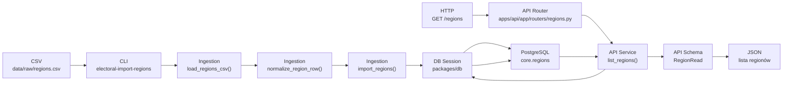
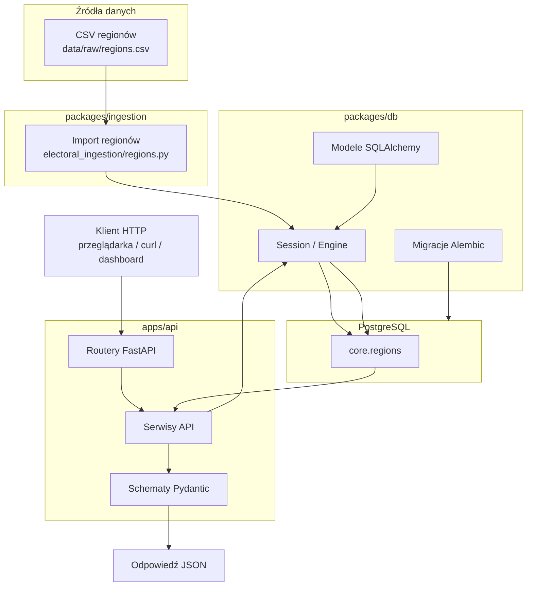

# Dokumentacja Flow Aplikacji

## Instrukcja Dla Codexa

Cel tego dokumentu: utrzymywać czytelną, chronologiczną dokumentację przepływu danych i
odpowiedzialności w aplikacji `electoral-drift`.

Przy każdym nowym feature aktualizuj ten plik według zasad:

- Dodaj nowy wpis w sekcji `Logi Flow`.
- Każdy wpis powinien zawierać:
  - krótki opis funkcjonalności,
  - diagram Mermaid pokazujący flow tylko dla tej funkcjonalności,
  - krótki opis diagramu w punktach.
- Dokument pisz po polsku.
- Diagramy Mermaid trzymaj możliwie proste i opisowe.
- Po każdym feature zaktualizuj sekcję `Aktualny Flow Całej Aplikacji` na dole pliku.
- Nie usuwaj starszych logów, chyba że użytkownik wyraźnie o to poprosi.
- Używaj nazw katalogów i funkcji zgodnych z aktualnym kodem.

## Logi Flow

### 2026-07-16 - Regiony: Import CSV I Odczyt Przez API

Dodano pierwszy pełny przepływ dla danych regionów. Regiony można zaimportować z pliku CSV do
tabeli `core.regions`, a następnie pobrać przez endpointy FastAPI.

Opis diagramu:

- Plik CSV jest wejściem dla procesu ingestion.
- Komenda `electoral-import-regions` uruchamia import regionów.
- `load_regions_csv()` czyta plik CSV.
- `normalize_region_row()` waliduje pojedynczy wiersz i pilnuje, aby `teryt_code` został tekstem.
- `import_regions()` zapisuje nowe regiony albo aktualizuje istniejące po `teryt_code`.
- API nie importuje CSV podczas requestu.
- Endpoint `GET /regions` czyta dane już zapisane w `core.regions`.
- `RegionRead` określa publiczny kształt odpowiedzi JSON.

## Aktualny Flow Całej Aplikacji

Ten diagram pokazuje aktualny przepływ całej aplikacji na wysokim poziomie. Powinien być
aktualizowany po każdym dodanym feature.

Najważniejsze zasady aktualnego flow:

- Ingestion zapisuje dane do bazy.
- API czyta dane z bazy i zwraca JSON.
- `packages/db` jest wspólną warstwą dla ingestion i API.
- Migracje Alembic definiują strukturę PostgreSQL.
- Frontend/dashboard nie jest jeszcze zaimplementowany.
